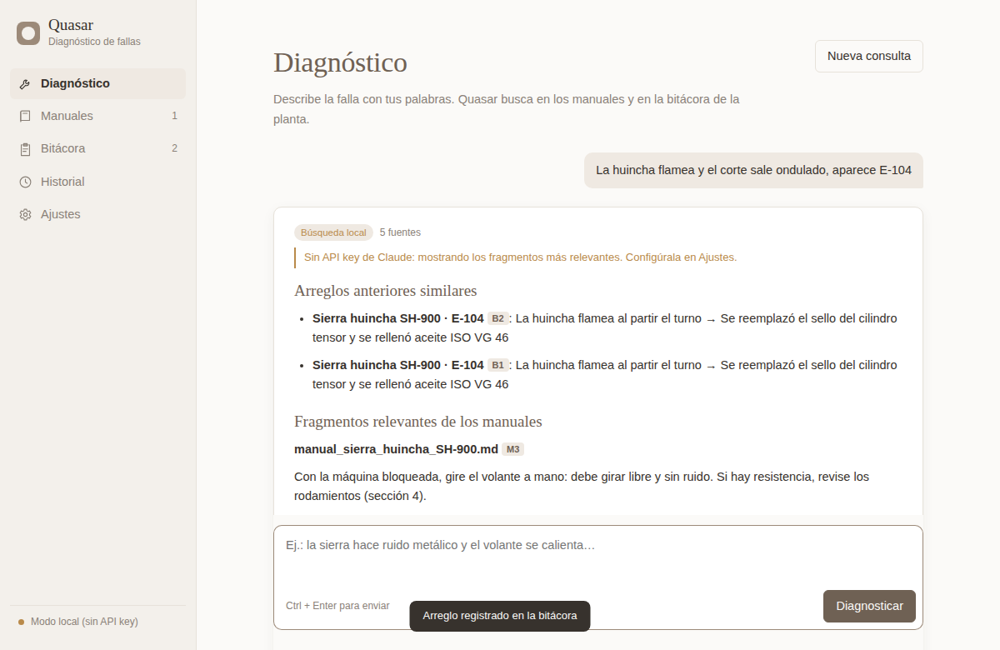

# Quasar

Asistente de IA para el **diagnóstico rápido de fallas en maquinaria industrial**. El técnico describe la falla
con sus propias palabras y Quasar busca en los manuales del fabricante y en la bitácora de arreglos de la planta
para entregar el diagnóstico y el procedimiento de reparación paso a paso.

Es una aplicación de escritorio (Tauri) con el motor del agente (el *harness*) escrito en Python.



```
┌──────────────── App de escritorio (Tauri) ────────────────┐
│  Interfaz HTML/CSS/JS  (app/src)                          │
│        │ fetch http://127.0.0.1:8765/api/…                │
│  Shell Rust (app/src-tauri) ── lanza ──► python3 -m quasar_motor
└───────────────────────────────────────────────────────────┘
                                             │
                    ┌────────────────────────┴───────────────────────┐
                    │  Motor Python (motor/quasar_motor)             │
                    │  · agente.py     bucle de agente + herramientas│
                    │  · busqueda.py   búsqueda BM25 (RAG)           │
                    │  · ingesta.py    PDF/TXT/MD → fragmentos       │
                    │  · almacen.py    SQLite en ~/.quasar           │
                    │  · servidor.py   API HTTP local                │
                    └────────────────────────────────────────────────┘
```

## Cómo funciona el motor

1. El técnico escribe la falla («la huincha flamea y aparece E-104»).
2. El agente (Claude, por defecto `claude-opus-5`) decide qué herramientas usar:
   - `buscar_manuales`: busca en los fragmentos de los manuales cargados (BM25, detecta códigos como `E-104`).
   - `buscar_bitacora`: busca en la bitácora de arreglos anteriores.
   - `listar_manuales`: lista los manuales disponibles.
3. Responde con **Diagnóstico → Procedimiento → Precauciones**, citando las fuentes (`[M12]` manual, `[B3]` bitácora).
4. El técnico puede **registrar el arreglo** en la bitácora, y la próxima consulta lo tendrá en cuenta.

Las preguntas de seguimiento continúan la misma conversación. Sin API key (o sin internet), Quasar funciona en
**modo local**: muestra los fragmentos y arreglos más relevantes sin pasar por el modelo.

Con `claude-opus-5` se activa el respaldo (*fallback*) del lado del servidor (`fallbacks: "default"`): si el modelo rechaza
una consulta, la API la reintenta con otro modelo automáticamente.

## Requisitos

- Python 3.10+
- Para la app de escritorio: Rust y Node.js, más los [prerrequisitos de Tauri](https://tauri.app/start/prerequisites/)
  de tu sistema operativo (en Linux: `libwebkit2gtk-4.1-dev`, `librsvg2-dev`, `libayatana-appindicator3-dev`).

## Puesta en marcha

```bash
# 1. Dependencias del motor
pip install -r motor/requirements.txt

# 2a. App de escritorio (abre la ventana y levanta el motor automáticamente)
cd app
npm install
npm run dev          # desarrollo
npm run build        # instalador para tu sistema operativo

# 2b. …o solo el motor con la interfaz en el navegador
cd motor
python -m quasar_motor --interfaz ../app/src     # http://127.0.0.1:8765
```

Luego:

1. **Ajustes** → pega tu API key de Anthropic y elige el modelo (se guarda en `~/.quasar/config.json`).
   También se toma `ANTHROPIC_API_KEY` del entorno.
2. **Manuales** → arrastra los PDF del fabricante, o pulsa *Cargar manual de ejemplo* (sierra huincha SH-900 ficticia).
3. **Diagnóstico** → describe la falla.

### Variables de entorno

| Variable | Uso |
|---|---|
| `ANTHROPIC_API_KEY` | API key (alternativa a Ajustes) |
| `QUASAR_DIR_DATOS` | Carpeta de datos (por defecto `~/.quasar`) |
| `QUASAR_PYTHON` | Intérprete que usa la app de escritorio (por defecto `python3`, o `python` en Windows) |
| `QUASAR_DIR_MOTOR` | Carpeta del motor, si no está junto a la app |

## Tests

```bash
cd motor
pip install pytest
python -m pytest -q
```

## Nombres en el código

Todo el código usa nombres en español (módulos, funciones, variables, rutas de la API, tablas de la base de
datos, herramientas del agente y clases CSS). Solo quedan en inglés las palabras propias de cada lenguaje o
librería y los archivos cuyo nombre exige la herramienta: `main.rs`, `lib.rs`, `build.rs`, `Cargo.toml`,
`package.json`, `index.html`, `requirements.txt`, `__init__.py` y `__main__.py`.

## Limitaciones de esta versión básica

- Los PDF escaneados (solo imagen) no tienen texto extraíble; habría que agregar OCR.
- La búsqueda es por palabras clave (BM25). Para manuales muy grandes convendría sumar embeddings.
- Las conversaciones de seguimiento viven en memoria: se reinician al cerrar la app (el historial de consultas sí se guarda).
- La app empaquetada usa el Python instalado en el equipo (no lo incluye).
